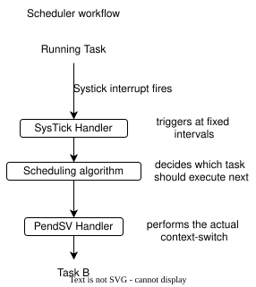

### zeroRTOS - a preemptive scheduler built for ARM Cortex M0+ architecture.

zeroRTOS is a preemptive scheduler built for ARM Cortex M0+ architecture, and specifically the *STM32L072CZYX* microcontroller, though it might work on other microcontrollers with the same architecture.

---

## Tech Stack
- Microcontroller - STM32L072CZYX - ARM Cortex-M0+ - ARMv6-M architecture
- Development Board - STM32 B-L072Z-LRWAN1
- Programming language - C, ARM Assembly
- Firmware Library - libopencm3
- cross-complier - arm-none-eabi-gcc
- Debugging/ firmware flashing - OpenOCD(via ST-Link), GDB
- IDE - Visual Studio Code
- Development host machine - Fedora Linux 43 (KDE Plasma Desktop Edition) x86_64

---

## Reference Material
- The Definitive Guide to ARM® Cortex®-M0 and Cortex-M0+ - Joseph Yiu - 2nd edition
- ARM® v6-M Architecture Reference Manual
- Reference Manual for STM32L0x2 - [pdf](https://www.st.com/resource/en/reference_manual/rm0376-ultralowpower-stm32l0x2-advanced-armbased-32bit-mcus-stmicroelectronics.pdf)
- User Manual for STM32L0 - UM2115

---

## Installation and running

**Disclaimer:** This project was developed and tested exclusively on **Fedora Linux**. All commands, installation procedures, and debugging workflows below are **Linux-specific**. If you are on Windows or macOS, we recommend using WSL2 or a Linux VM.

The project assumes you are using a stm32l072czyx microcontroller, and flashing/debugging via ST-Link.

### Pre-requisites
- `make`
- `arm-none-eabi-gcc`
- `openocd`
- `arm-none-eabi-gdb` (optional, for debugging)

<br>

**Installation command:**
Fedora:
```bash
sudo dnf install make arm-none-eabi-gcc openocd arm-none-eabi-gdb -y
```

**Change your project directory to trusted list**
```bash
# Run this from the root of the zeroRTOS repository
echo "add-auto-load-safe-path $(pwd)" >> ~/.gdbinit
```
<br>

### Usage
Application code should be written in `src/main.c`
There is an example code in it as a default.

**Firmware binary**
The final flashable firmware is produced as `firmware.elf` by default. You can change this binary name by changing the `BINARY` value in `src/Makefile`

Along with the binary, `.elf` `.hex` `.map` are also produced by default, under the same name as `BINARY` Makefile variable, for the firmware.

**Adding new files**
Every new source file added must be added in `src/Makefile` under `OBJS` Makefile variable as a `.o` file, to make it known to the compiler of a new object file it has to produce.


<br>

### Building the firmware binary
```bash
make
```

<br>

### Flashing the firmware binary
```bash
openocd -f interface/stlink.cfg -f target/stm32l0.cfg -c program firmware.elf verify reset exit
```

---

## Architecture
<p align="center">
  <kbd style="background-color: #ffffff; display: inline-block; padding: 16px; border-radius: 8px;">
    
  </kbd>
</p>
